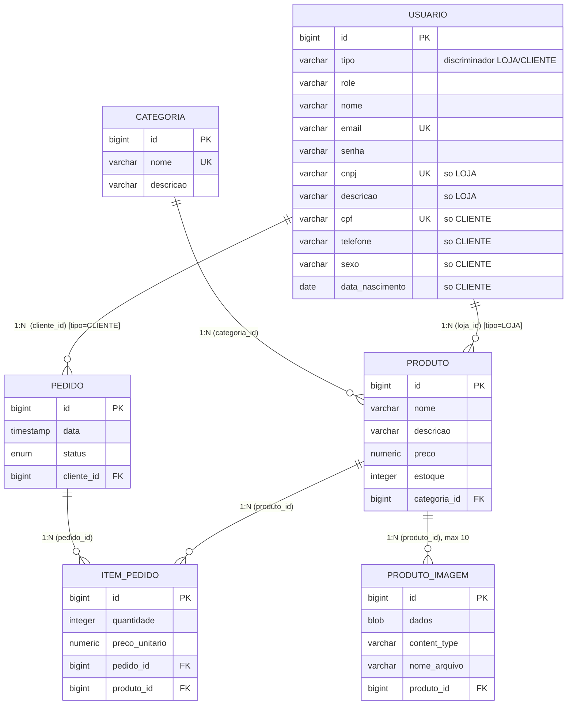

# Mapeamento Objeto-Relacional (JPA) — Loja Web

Documento do mapeamento **Java Persistence API (JPA)** do sistema: cada entidade
Java (`@Entity`) é mapeada para uma tabela relacional, e os relacionamentos entre
objetos são traduzidos para chaves estrangeiras. A implementação JPA utilizada é o
**Hibernate** (via Spring Data JPA), sobre banco **H2**.

## Diagrama de Entidade-Relacionamento



> **Herança JPA:** `Loja` e `Cliente` são subclasses da entidade abstrata `Usuario`,
> mapeadas com a estratégia **`SINGLE_TABLE`** — todas ficam na tabela `usuario`,
> diferenciadas pela coluna discriminadora `tipo`. As colunas específicas de cada
> subtipo (cnpj, cpf, sexo...) são anuláveis no banco (a obrigatoriedade vale via Bean
> Validation por tipo). As FKs `produto.loja_id` e `pedido.cliente_id` referenciam a
> tabela `usuario`. O **administrador NÃO é uma entidade** — é definido diretamente em
> `UsuarioDetailsService` (não fica no banco).

## Resumo dos relacionamentos

| Relacionamento | Cardinalidade | Lado dono (FK) | Lado inverso (`mappedBy`) | Anotações |
|----------------|---------------|----------------|---------------------------|-----------|
| Categoria – Produto | 1 : N | `Produto.categoria` (`categoria_id`) | `Categoria.produtos` | `@ManyToOne` / `@OneToMany` |
| Loja – Produto | 1 : N | `Produto.loja` (`loja_id`) | `Loja.produtos` | `@ManyToOne` / `@OneToMany` |
| Cliente – Pedido | 1 : N | `Pedido.cliente` (`cliente_id`) | `Cliente.pedidos` | `@ManyToOne` / `@OneToMany` |
| Pedido – ItemPedido | 1 : N | `ItemPedido.pedido` (`pedido_id`) | `Pedido.itens` | `@ManyToOne` / `@OneToMany` |
| Produto – ItemPedido | 1 : N | `ItemPedido.produto` (`produto_id`) | (sem coleção inversa) | `@ManyToOne` |
| Produto – ProdutoImagem | 1 : N (máx. 10) | `ProdutoImagem.produto` (`produto_id`) | `Produto.imagens` | `@ManyToOne` / `@OneToMany` |

`ItemPedido` é uma **entidade de associação** entre `Pedido` e `Produto`, com
atributos próprios (`quantidade`, `preco_unitario`), modelando o N:N "produtos de
um pedido" com dados adicionais.

---

## Mapeamento por entidade

Convenções de coluna: PK = chave primária, FK = chave estrangeira, UK = único (unique).

### Categoria → tabela `categoria`

| Atributo Java | Coluna | Tipo SQL | Anotações JPA / Validação |
|---------------|--------|----------|----------------------------|
| `id` | `id` | `bigint` (PK, identity) | `@Id`, `@GeneratedValue(strategy = IDENTITY)` |
| `nome` | `nome` | `varchar(80)` not null, **unique** | `@Column(nullable=false, unique=true, length=80)`, `@NotBlank` |
| `descricao` | `descricao` | `varchar(255)` | `@Column(length=255)` |
| `produtos` | — (lado inverso) | — | `@OneToMany(mappedBy="categoria", cascade=ALL, orphanRemoval=true)`, `@JsonIgnore` |

### Produto → tabela `produto`

| Atributo Java | Coluna | Tipo SQL | Anotações JPA / Validação |
|---------------|--------|----------|----------------------------|
| `id` | `id` | `bigint` (PK, identity) | `@Id`, `@GeneratedValue(IDENTITY)` |
| `nome` | `nome` | `varchar(120)` not null | `@Column(nullable=false, length=120)`, `@NotBlank` |
| `descricao` | `descricao` | `varchar(255)` | `@Column(length=255)` |
| `preco` | `preco` | `numeric(10,2)` not null | `@Column(nullable=false, precision=10, scale=2)`, `@NotNull`, `@PositiveOrZero` |
| `estoque` | `estoque` | `integer` not null | `@Column(nullable=false)`, `@PositiveOrZero` |
| `categoria` | `categoria_id` | `bigint` (FK → `categoria.id`) not null | `@ManyToOne(fetch=EAGER, optional=false)`, `@JoinColumn(name="categoria_id", nullable=false)` |
| `loja` | `loja_id` | `bigint` (FK → `usuario.id`) not null | `@ManyToOne(fetch=EAGER, optional=false)`, `@JoinColumn(name="loja_id", nullable=false)` |
| `imagens` | — (lado inverso) | — | `@OneToMany(mappedBy="produto", cascade=ALL, orphanRemoval=true)`, `@JsonIgnore` |

### Usuario → tabela `usuario` (classe-mãe abstrata, herança SINGLE_TABLE)

| Atributo Java | Coluna | Tipo SQL | Anotações JPA / Validação |
|---------------|--------|----------|----------------------------|
| `id` | `id` | `bigint` (PK, identity) | `@Id`, `@GeneratedValue(IDENTITY)` |
| (discriminador) | `tipo` | `varchar` (`LOJA`/`CLIENTE`) | `@DiscriminatorColumn(name="tipo")` |
| `nome` | `nome` | `varchar(120)` not null | `@Column(nullable=false, length=120)`, `@NotBlank` |
| `email` | `email` | `varchar(120)` not null, **unique** | `@Column(nullable=false, unique=true, length=120)`, `@Email`, `@NotBlank` |
| `senha` | `senha` | `varchar(100)` not null | `@Column(nullable=false, length=100)`, `@NotBlank`, `@JsonProperty(WRITE_ONLY)` |
| `role` | `role` | `varchar(20)` not null | definido pelo construtor da subclasse (`"LOJA"`/`"CLIENTE"`) |

Anotações de classe: `@Entity`, `@Inheritance(strategy = SINGLE_TABLE)`, `@DiscriminatorColumn(name="tipo")`.

### Cliente → subclasse de `Usuario` (`tipo` = CLIENTE)

Herda `id`, `nome`, `email`, `senha`, `role` de `Usuario` (role = `"CLIENTE"`). Campos próprios
(colunas anuláveis na tabela `usuario`, pois lojas não os têm):

| Atributo Java | Coluna | Tipo SQL | Anotações JPA / Validação |
|---------------|--------|----------|----------------------------|
| `cpf` | `cpf` | `varchar(14)` **unique** | `@Column(unique=true, length=14)`, `@NotBlank` (sem validador de formato) |
| `telefone` | `telefone` | `varchar(20)` | `@Column(length=20)` |
| `sexo` | `sexo` | `enum('MASCULINO','FEMININO','OUTRO')` | `@Enumerated(STRING)`, `@NotNull` |
| `dataNascimento` | `data_nascimento` | `date` | `@Past`, `@NotNull` |
| `pedidos` | — (lado inverso) | — | `@OneToMany(mappedBy="cliente", cascade=ALL, orphanRemoval=true)`, `@JsonIgnore` |

Anotação de classe: `@Entity`, `@DiscriminatorValue("CLIENTE")`.

### Loja → subclasse de `Usuario` (`tipo` = LOJA)

Herda `id`, `nome`, `email`, `senha`, `role` de `Usuario` (role = `"LOJA"`). Campos próprios:

| Atributo Java | Coluna | Tipo SQL | Anotações JPA / Validação |
|---------------|--------|----------|----------------------------|
| `cnpj` | `cnpj` | `varchar(20)` **unique** | `@Column(unique=true, length=20)`, `@NotBlank` (sem validador de formato) |
| `descricao` | `descricao` | `varchar(255)` | `@Column(length=255)` |
| `produtos` | — (lado inverso) | — | `@OneToMany(mappedBy="loja", cascade=ALL, orphanRemoval=true)`, `@JsonIgnore` |

Anotação de classe: `@Entity`, `@DiscriminatorValue("LOJA")`.

> A senha é gravada com **hash BCrypt**; `WRITE_ONLY` permite recebê-la em JSON mas
> nunca a expõe. **O administrador não é entidade** — é fixo em `UsuarioDetailsService`.

### Pedido → tabela `pedido`

| Atributo Java | Coluna | Tipo SQL | Anotações JPA / Validação |
|---------------|--------|----------|----------------------------|
| `id` | `id` | `bigint` (PK, identity) | `@Id`, `@GeneratedValue(IDENTITY)` |
| `data` | `data` | `timestamp(6)` not null | `@Column(nullable=false)` (tipo `LocalDateTime`) |
| `status` | `status` | `enum('ABERTO','PAGO','ENVIADO','CANCELADO')` not null | `@Enumerated(EnumType.STRING)`, `@Column(nullable=false, length=20)` |
| `cliente` | `cliente_id` | `bigint` (FK → `usuario.id`) not null | `@ManyToOne(fetch=EAGER, optional=false)`, `@JoinColumn(name="cliente_id", nullable=false)` |
| `itens` | — (lado inverso) | — | `@OneToMany(mappedBy="pedido", cascade=ALL, orphanRemoval=true)` |

> `getTotal()` é um método derivado (não mapeado): soma os subtotais dos itens.

### ItemPedido → tabela `item_pedido`

| Atributo Java | Coluna | Tipo SQL | Anotações JPA / Validação |
|---------------|--------|----------|----------------------------|
| `id` | `id` | `bigint` (PK, identity) | `@Id`, `@GeneratedValue(IDENTITY)` |
| `quantidade` | `quantidade` | `integer` not null | `@Column(nullable=false)`, `@Positive` |
| `precoUnitario` | `preco_unitario` | `numeric(10,2)` not null | `@Column(nullable=false, precision=10, scale=2)` |
| `pedido` | `pedido_id` | `bigint` (FK → `pedido.id`) not null | `@ManyToOne(fetch=EAGER, optional=false)`, `@JoinColumn(name="pedido_id", nullable=false)`, `@JsonIgnore` |
| `produto` | `produto_id` | `bigint` (FK → `produto.id`) not null | `@ManyToOne(fetch=EAGER, optional=false)`, `@JoinColumn(name="produto_id", nullable=false)` |

> `getSubtotal()` é derivado: `preco_unitario × quantidade`.

### ProdutoImagem → tabela `produto_imagem`

| Atributo Java | Coluna | Tipo SQL | Anotações JPA / Validação |
|---------------|--------|----------|----------------------------|
| `id` | `id` | `bigint` (PK, identity) | `@Id`, `@GeneratedValue(IDENTITY)` |
| `dados` | `dados` | `blob` not null | `@Lob`, `@Column(nullable=false)`, `@JsonIgnore` — bytes da imagem |
| `contentType` | `content_type` | `varchar(100)` not null | `@Column(nullable=false, length=100)` — tipo MIME (ex.: image/png) |
| `nomeArquivo` | `nome_arquivo` | `varchar(255)` | `@Column(length=255)` |
| `produto` | `produto_id` | `bigint` (FK → `produto.id`) not null | `@ManyToOne(fetch=LAZY, optional=false)`, `@JoinColumn(name="produto_id", nullable=false)`, `@JsonIgnore` |

> A imagem é armazenada **no próprio banco** como `byte[]` mapeado para um **BLOB**
> (`@Lob`), junto com o seu `content_type`. O endpoint `GET /produtos/imagens/{id}`
> devolve os bytes com esse content-type, permitindo usar ``.
> Cada produto aceita no máximo **10** imagens (regra em `ProdutoService`).

---

## Anotações JPA utilizadas (resumo)

| Anotação | Função no mapeamento |
|----------|----------------------|
| `@Entity` | Marca a classe como entidade persistente. |
| `@Table(name=...)` | Define o nome da tabela mapeada. |
| `@Id` | Indica a chave primária. |
| `@GeneratedValue(strategy = GenerationType.IDENTITY)` | A PK é gerada pelo banco (coluna *identity*). |
| `@Column(...)` | Configura a coluna: `nullable`, `unique`, `length`, `precision`, `scale`. |
| `@ManyToOne` | Lado "muitos" de um relacionamento N:1 (dono da FK). |
| `@OneToMany(mappedBy=...)` | Lado "um" (inverso) de um relacionamento 1:N. |
| `@JoinColumn(name=...)` | Nome da coluna de chave estrangeira. |
| `@Enumerated(EnumType.STRING)` | Persiste o enum como texto (e não pelo índice ordinal). |
| `@Lob` | Mapeia o atributo para um objeto grande (BLOB) — usado para os bytes da imagem. |
| `@Inheritance(strategy = SINGLE_TABLE)` | Estratégia de herança: todas as subclasses numa única tabela. |
| `@DiscriminatorColumn` / `@DiscriminatorValue` | Coluna que distingue o subtipo (`tipo`) e o valor de cada subclasse. |
| `cascade = CascadeType.ALL` | Propaga operações (persist/merge/remove) da entidade pai aos filhos. |
| `orphanRemoval = true` | Remove do banco o filho retirado da coleção do pai. |
| `fetch = FetchType.EAGER/LAZY` | Estratégia de carregamento da associação. |

Anotações de **Bean Validation** (pacote `jakarta.validation` / Hibernate Validator)
complementam o mapeamento garantindo a integridade dos dados nos formulários e na
REST-API: `@NotBlank`, `@NotNull`, `@Email`, `@Past`, `@Positive`, `@PositiveOrZero`.
(CPF e CNPJ são apenas obrigatórios e únicos — sem validador de formato.)

---

## DDL gerado pelo Hibernate (real)

Esquema criado/atualizado automaticamente (`spring.jpa.hibernate.ddl-auto=update`, H2 em arquivo):

```sql
-- Tabela unica da heranca (Usuario + subclasses Loja e Cliente)
create table usuario (
    tipo varchar(31) not null,                 -- discriminador: LOJA ou CLIENTE
    id bigint generated by default as identity,
    nome varchar(120) not null,
    email varchar(120) not null unique,
    senha varchar(100) not null,
    role varchar(20) not null,                 -- "LOJA" ou "CLIENTE"
    cnpj varchar(20) unique,                   -- so LOJA (anulavel)
    descricao varchar(255),                    -- so LOJA
    cpf varchar(14) unique,                    -- so CLIENTE (anulavel)
    telefone varchar(20),                      -- so CLIENTE
    sexo enum ('FEMININO','MASCULINO','OUTRO'),-- so CLIENTE
    data_nascimento date,                      -- so CLIENTE
    primary key (id)
);

create table categoria (
    id bigint generated by default as identity,
    nome varchar(80) not null unique,
    descricao varchar(255),
    primary key (id)
);

create table produto (
    estoque integer not null,
    preco numeric(10,2) not null,
    categoria_id bigint not null,
    loja_id bigint not null,
    id bigint generated by default as identity,
    nome varchar(120) not null,
    descricao varchar(255),
    primary key (id)
);

create table pedido (
    cliente_id bigint not null,
    data timestamp(6) not null,
    id bigint generated by default as identity,
    status enum ('ABERTO','CANCELADO','ENVIADO','PAGO') not null,
    primary key (id)
);

create table item_pedido (
    preco_unitario numeric(10,2) not null,
    quantidade integer not null,
    id bigint generated by default as identity,
    pedido_id bigint not null,
    produto_id bigint not null,
    primary key (id)
);

create table produto_imagem (
    id bigint generated by default as identity,
    dados blob not null,
    content_type varchar(100) not null,
    nome_arquivo varchar(255),
    produto_id bigint not null,
    primary key (id)
);

-- Chaves estrangeiras
alter table produto         add constraint fk_produto_categoria      foreign key (categoria_id) references categoria;
alter table produto         add constraint fk_produto_loja           foreign key (loja_id)      references usuario;
alter table pedido          add constraint fk_pedido_cliente         foreign key (cliente_id)   references usuario;
alter table item_pedido     add constraint fk_item_pedido_pedido     foreign key (pedido_id)    references pedido;
alter table item_pedido     add constraint fk_item_pedido_produto    foreign key (produto_id)   references produto;
alter table produto_imagem  add constraint fk_produto_imagem_produto foreign key (produto_id)   references produto;
```

> Os nomes das constraints de FK acima foram simplificados para leitura; o
> Hibernate gera nomes automáticos (ex.: `FK60ym08cfoysa17wrn1swyiuda`).
