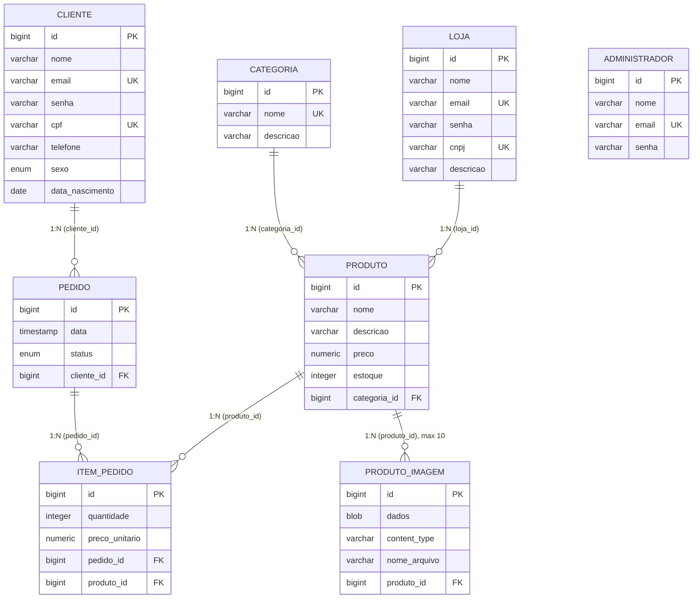

# Mapeamento Objeto-Relacional (JPA) — Loja Web

Documento do mapeamento **Java Persistence API (JPA)** do sistema: cada entidade
Java (`@Entity`) é mapeada para uma tabela relacional, e os relacionamentos entre
objetos são traduzidos para chaves estrangeiras. A implementação JPA utilizada é o
**Hibernate** (via Spring Data JPA), sobre banco **H2**.

## Diagrama de Entidade-Relacionamento



> `ADMINISTRADOR` é uma entidade independente (sem relacionamentos): representa o
> operador da loja, usado apenas para autenticação (ROLE_ADMIN).

## Resumo dos relacionamentos

| Relacionamento | Cardinalidade | Lado dono (FK) | Lado inverso (`mappedBy`) | Anotações |
|----------------|---------------|----------------|---------------------------|-----------|
| Categoria – Produto | 1 : N | `Produto.categoria` (`categoria_id`) | `Categoria.produtos` | `@ManyToOne` / `@OneToMany` |
| Loja – Produto | 1 : N | `Produto.loja` (`loja_id`) | `Loja.produtos` | `@ManyToOne` / `@OneToMany` |
| Cliente – Pedido | 1 : N | `Pedido.cliente` (`cliente_id`) | `Cliente.pedidos` | `@ManyToOne` / `@OneToMany` |
| Pedido – ItemPedido | 1 : N | `ItemPedido.pedido` (`pedido_id`) | `Pedido.itens` | `@ManyToOne` / `@OneToMany` |
| Produto – ItemPedido | 1 : N | `ItemPedido.produto` (`produto_id`) | (sem coleção inversa) | `@ManyToOne` |
| Produto – ProdutoImagem | 1 : N (máx. 10) | `ProdutoImagem.produto` (`produto_id`) | `Produto.imagens` | `@ManyToOne` / `@OneToMany` |

`ItemPedido` é uma **entidade de associação** entre `Pedido` e `Produto`, com
atributos próprios (`quantidade`, `preco_unitario`), modelando o N:N "produtos de
um pedido" com dados adicionais.

---

## Mapeamento por entidade

Convenções de coluna: PK = chave primária, FK = chave estrangeira, UK = único (unique).

### Categoria → tabela `categoria`

| Atributo Java | Coluna | Tipo SQL | Anotações JPA / Validação |
|---------------|--------|----------|----------------------------|
| `id` | `id` | `bigint` (PK, identity) | `@Id`, `@GeneratedValue(strategy = IDENTITY)` |
| `nome` | `nome` | `varchar(80)` not null, **unique** | `@Column(nullable=false, unique=true, length=80)`, `@NotBlank` |
| `descricao` | `descricao` | `varchar(255)` | `@Column(length=255)` |
| `produtos` | — (lado inverso) | — | `@OneToMany(mappedBy="categoria", cascade=ALL, orphanRemoval=true)`, `@JsonIgnore` |

### Produto → tabela `produto`

| Atributo Java | Coluna | Tipo SQL | Anotações JPA / Validação |
|---------------|--------|----------|----------------------------|
| `id` | `id` | `bigint` (PK, identity) | `@Id`, `@GeneratedValue(IDENTITY)` |
| `nome` | `nome` | `varchar(120)` not null | `@Column(nullable=false, length=120)`, `@NotBlank` |
| `descricao` | `descricao` | `varchar(255)` | `@Column(length=255)` |
| `preco` | `preco` | `numeric(10,2)` not null | `@Column(nullable=false, precision=10, scale=2)`, `@NotNull`, `@PositiveOrZero` |
| `estoque` | `estoque` | `integer` not null | `@Column(nullable=false)`, `@PositiveOrZero` |
| `categoria` | `categoria_id` | `bigint` (FK → `categoria.id`) not null | `@ManyToOne(fetch=EAGER, optional=false)`, `@JoinColumn(name="categoria_id", nullable=false)` |
| `loja` | `loja_id` | `bigint` (FK → `loja.id`) not null | `@ManyToOne(fetch=EAGER, optional=false)`, `@JoinColumn(name="loja_id", nullable=false)` |
| `imagens` | — (lado inverso) | — | `@OneToMany(mappedBy="produto", cascade=ALL, orphanRemoval=true)`, `@JsonIgnore` |

### Cliente → tabela `cliente`

| Atributo Java | Coluna | Tipo SQL | Anotações JPA / Validação |
|---------------|--------|----------|----------------------------|
| `id` | `id` | `bigint` (PK, identity) | `@Id`, `@GeneratedValue(IDENTITY)` |
| `nome` | `nome` | `varchar(120)` not null | `@Column(nullable=false, length=120)`, `@NotBlank` |
| `email` | `email` | `varchar(120)` not null, **unique** | `@Column(nullable=false, unique=true, length=120)`, `@Email`, `@NotBlank` |
| `senha` | `senha` | `varchar(100)` not null | `@Column(nullable=false, length=100)`, `@NotBlank`, `@JsonProperty(access=WRITE_ONLY)` |
| `cpf` | `cpf` | `varchar(14)` not null, **unique** | `@Column(nullable=false, unique=true, length=14)`, `@CPF`, `@NotBlank` |
| `telefone` | `telefone` | `varchar(20)` | `@Column(length=20)` |
| `sexo` | `sexo` | `enum('MASCULINO','FEMININO','OUTRO')` not null | `@Enumerated(EnumType.STRING)`, `@Column(nullable=false, length=10)`, `@NotNull` |
| `dataNascimento` | `data_nascimento` | `date` not null | `@Column(nullable=false)`, `@Past`, `@NotNull` |
| `pedidos` | — (lado inverso) | — | `@OneToMany(mappedBy="cliente", cascade=ALL, orphanRemoval=true)`, `@JsonIgnore` |

> A senha é armazenada com **hash BCrypt**; `WRITE_ONLY` permite recebê-la em JSON
> (POST da REST-API) mas nunca a expõe nas respostas.

### Loja → tabela `loja`

| Atributo Java | Coluna | Tipo SQL | Anotações JPA / Validação |
|---------------|--------|----------|----------------------------|
| `id` | `id` | `bigint` (PK, identity) | `@Id`, `@GeneratedValue(IDENTITY)` |
| `nome` | `nome` | `varchar(120)` not null | `@Column(nullable=false, length=120)`, `@NotBlank` |
| `email` | `email` | `varchar(120)` not null, **unique** | `@Column(nullable=false, unique=true, length=120)`, `@Email`, `@NotBlank` |
| `senha` | `senha` | `varchar(100)` not null | `@Column(nullable=false, length=100)`, `@NotBlank`, `@JsonProperty(WRITE_ONLY)` |
| `cnpj` | `cnpj` | `varchar(20)` not null, **unique** | `@Column(nullable=false, unique=true, length=20)`, `@NotBlank` (sem validador de formato) |
| `descricao` | `descricao` | `varchar(255)` | `@Column(length=255)` |
| `produtos` | — (lado inverso) | — | `@OneToMany(mappedBy="loja", cascade=ALL, orphanRemoval=true)`, `@JsonIgnore` |

### Administrador → tabela `administrador`

| Atributo Java | Coluna | Tipo SQL | Anotações JPA / Validação |
|---------------|--------|----------|----------------------------|
| `id` | `id` | `bigint` (PK, identity) | `@Id`, `@GeneratedValue(IDENTITY)` |
| `nome` | `nome` | `varchar(120)` not null | `@Column(nullable=false, length=120)`, `@NotBlank` |
| `email` | `email` | `varchar(120)` not null, **unique** | `@Column(nullable=false, unique=true, length=120)`, `@Email`, `@NotBlank` |
| `senha` | `senha` | `varchar(100)` not null | `@Column(nullable=false, length=100)`, `@NotBlank`, `@JsonIgnore` |

### Pedido → tabela `pedido`

| Atributo Java | Coluna | Tipo SQL | Anotações JPA / Validação |
|---------------|--------|----------|----------------------------|
| `id` | `id` | `bigint` (PK, identity) | `@Id`, `@GeneratedValue(IDENTITY)` |
| `data` | `data` | `timestamp(6)` not null | `@Column(nullable=false)` (tipo `LocalDateTime`) |
| `status` | `status` | `enum('ABERTO','PAGO','ENVIADO','CANCELADO')` not null | `@Enumerated(EnumType.STRING)`, `@Column(nullable=false, length=20)` |
| `cliente` | `cliente_id` | `bigint` (FK → `cliente.id`) not null | `@ManyToOne(fetch=EAGER, optional=false)`, `@JoinColumn(name="cliente_id", nullable=false)` |
| `itens` | — (lado inverso) | — | `@OneToMany(mappedBy="pedido", cascade=ALL, orphanRemoval=true)` |

> `getTotal()` é um método derivado (não mapeado): soma os subtotais dos itens.

### ItemPedido → tabela `item_pedido`

| Atributo Java | Coluna | Tipo SQL | Anotações JPA / Validação |
|---------------|--------|----------|----------------------------|
| `id` | `id` | `bigint` (PK, identity) | `@Id`, `@GeneratedValue(IDENTITY)` |
| `quantidade` | `quantidade` | `integer` not null | `@Column(nullable=false)`, `@Positive` |
| `precoUnitario` | `preco_unitario` | `numeric(10,2)` not null | `@Column(nullable=false, precision=10, scale=2)` |
| `pedido` | `pedido_id` | `bigint` (FK → `pedido.id`) not null | `@ManyToOne(fetch=EAGER, optional=false)`, `@JoinColumn(name="pedido_id", nullable=false)`, `@JsonIgnore` |
| `produto` | `produto_id` | `bigint` (FK → `produto.id`) not null | `@ManyToOne(fetch=EAGER, optional=false)`, `@JoinColumn(name="produto_id", nullable=false)` |

> `getSubtotal()` é derivado: `preco_unitario × quantidade`.

### ProdutoImagem → tabela `produto_imagem`

| Atributo Java | Coluna | Tipo SQL | Anotações JPA / Validação |
|---------------|--------|----------|----------------------------|
| `id` | `id` | `bigint` (PK, identity) | `@Id`, `@GeneratedValue(IDENTITY)` |
| `dados` | `dados` | `blob` not null | `@Lob`, `@Column(nullable=false)`, `@JsonIgnore` — bytes da imagem |
| `contentType` | `content_type` | `varchar(100)` not null | `@Column(nullable=false, length=100)` — tipo MIME (ex.: image/png) |
| `nomeArquivo` | `nome_arquivo` | `varchar(255)` | `@Column(length=255)` |
| `produto` | `produto_id` | `bigint` (FK → `produto.id`) not null | `@ManyToOne(fetch=LAZY, optional=false)`, `@JoinColumn(name="produto_id", nullable=false)`, `@JsonIgnore` |

> A imagem é armazenada **no próprio banco** como `byte[]` mapeado para um **BLOB**
> (`@Lob`), junto com o seu `content_type`. O endpoint `GET /produtos/imagens/{id}`
> devolve os bytes com esse content-type, permitindo usar ``.
> Cada produto aceita no máximo **10** imagens (regra em `ProdutoService`).

---

## Anotações JPA utilizadas (resumo)

| Anotação | Função no mapeamento |
|----------|----------------------|
| `@Entity` | Marca a classe como entidade persistente. |
| `@Table(name=...)` | Define o nome da tabela mapeada. |
| `@Id` | Indica a chave primária. |
| `@GeneratedValue(strategy = GenerationType.IDENTITY)` | A PK é gerada pelo banco (coluna *identity*). |
| `@Column(...)` | Configura a coluna: `nullable`, `unique`, `length`, `precision`, `scale`. |
| `@ManyToOne` | Lado "muitos" de um relacionamento N:1 (dono da FK). |
| `@OneToMany(mappedBy=...)` | Lado "um" (inverso) de um relacionamento 1:N. |
| `@JoinColumn(name=...)` | Nome da coluna de chave estrangeira. |
| `@Enumerated(EnumType.STRING)` | Persiste o enum como texto (e não pelo índice ordinal). |
| `@Lob` | Mapeia o atributo para um objeto grande (BLOB) — usado para os bytes da imagem. |
| `cascade = CascadeType.ALL` | Propaga operações (persist/merge/remove) da entidade pai aos filhos. |
| `orphanRemoval = true` | Remove do banco o filho retirado da coleção do pai. |
| `fetch = FetchType.EAGER/LAZY` | Estratégia de carregamento da associação. |

Anotações de **Bean Validation** (pacote `jakarta.validation` / Hibernate Validator)
complementam o mapeamento garantindo a integridade dos dados nos formulários e na
REST-API: `@NotBlank`, `@NotNull`, `@Email`, `@Past`, `@Positive`, `@PositiveOrZero`
e `@CPF`.

---

## DDL gerado pelo Hibernate (real)

Esquema criado automaticamente na inicialização (`spring.jpa.hibernate.ddl-auto=create-drop`):

```sql
create table administrador (
    id bigint generated by default as identity,
    senha varchar(100) not null,
    email varchar(120) not null unique,
    nome varchar(120) not null,
    primary key (id)
);

create table categoria (
    id bigint generated by default as identity,
    nome varchar(80) not null unique,
    descricao varchar(255),
    primary key (id)
);

create table cliente (
    data_nascimento date not null,
    id bigint generated by default as identity,
    cpf varchar(14) not null unique,
    telefone varchar(20),
    senha varchar(100) not null,
    email varchar(120) not null unique,
    nome varchar(120) not null,
    sexo enum ('FEMININO','MASCULINO','OUTRO') not null,
    primary key (id)
);

create table loja (
    id bigint generated by default as identity,
    nome varchar(120) not null,
    email varchar(120) not null unique,
    senha varchar(100) not null,
    cnpj varchar(20) not null unique,
    descricao varchar(255),
    primary key (id)
);

create table produto (
    estoque integer not null,
    preco numeric(10,2) not null,
    categoria_id bigint not null,
    loja_id bigint not null,
    id bigint generated by default as identity,
    nome varchar(120) not null,
    descricao varchar(255),
    primary key (id)
);

create table pedido (
    cliente_id bigint not null,
    data timestamp(6) not null,
    id bigint generated by default as identity,
    status enum ('ABERTO','CANCELADO','ENVIADO','PAGO') not null,
    primary key (id)
);

create table item_pedido (
    preco_unitario numeric(10,2) not null,
    quantidade integer not null,
    id bigint generated by default as identity,
    pedido_id bigint not null,
    produto_id bigint not null,
    primary key (id)
);

create table produto_imagem (
    id bigint generated by default as identity,
    dados blob not null,
    content_type varchar(100) not null,
    nome_arquivo varchar(255),
    produto_id bigint not null,
    primary key (id)
);

-- Chaves estrangeiras
alter table produto         add constraint fk_produto_categoria      foreign key (categoria_id) references categoria;
alter table produto         add constraint fk_produto_loja           foreign key (loja_id)      references loja;
alter table pedido          add constraint fk_pedido_cliente         foreign key (cliente_id)   references cliente;
alter table item_pedido     add constraint fk_item_pedido_pedido     foreign key (pedido_id)    references pedido;
alter table item_pedido     add constraint fk_item_pedido_produto    foreign key (produto_id)   references produto;
alter table produto_imagem  add constraint fk_produto_imagem_produto foreign key (produto_id)   references produto;
```

> Os nomes das constraints de FK acima foram simplificados para leitura; o
> Hibernate gera nomes automáticos (ex.: `FK60ym08cfoysa17wrn1swyiuda`).
